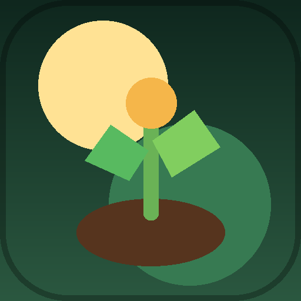
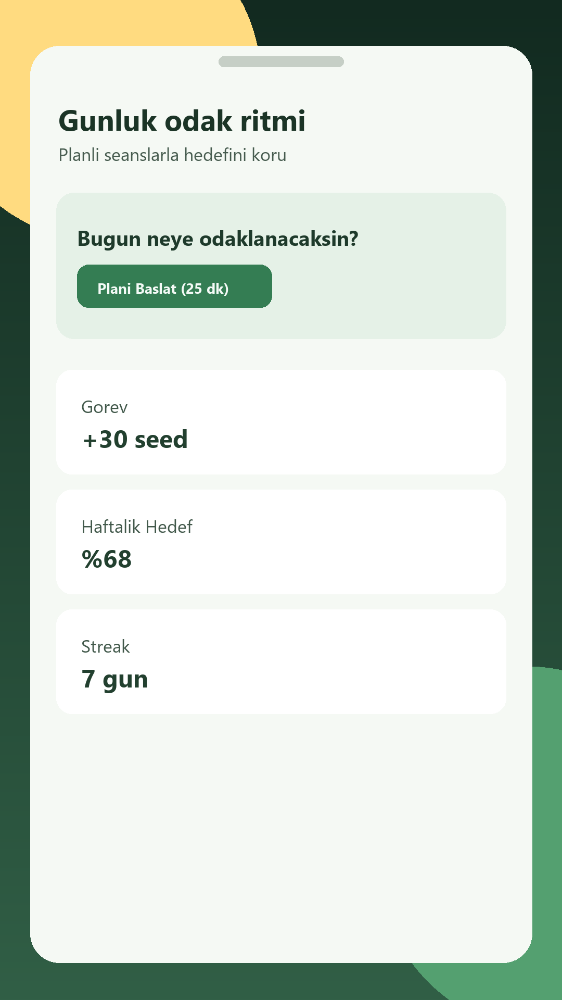
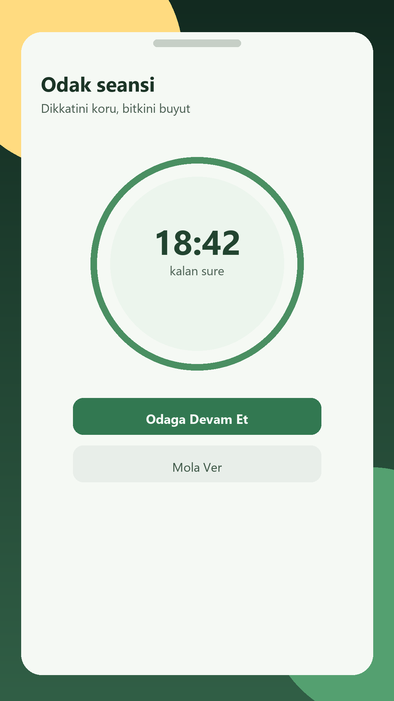
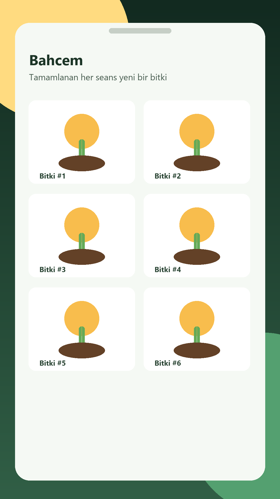
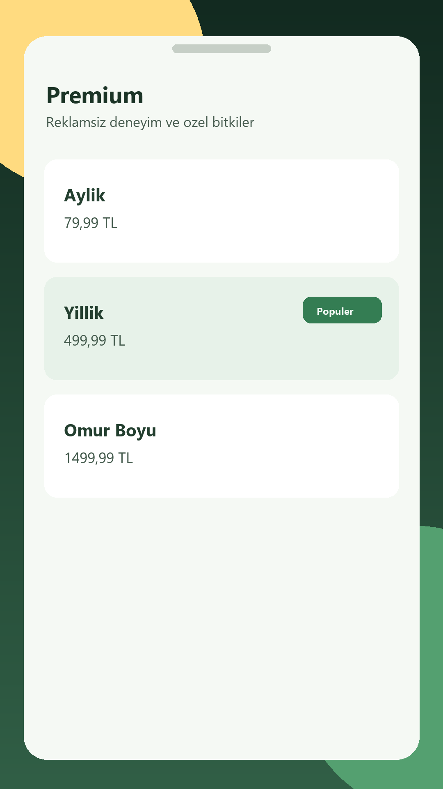

# 🚜 FocusFarm

**FocusFarm**, verimliliğinizi artırmak için oyunlaştırma (gamification) öğelerini kullanan, modern bir odaklanma (pomodoro) ve bahçe yönetimi uygulamasıdır. Telefonu kenara bırakın, odaklanın ve sanal bahçenizi büyütün!

<p align="center">
  
</p>

---

## 📸 Ekran Görüntüleri

<p align="center">
  
  
  
  
</p>

---

## ✨ Özellikler

- **Odak Timer**: Belirlediğiniz süre boyunca odaklanın. Süre bittiğinde bitkiniz yetişir, erken pes ederseniz solar!
- **Kişisel Bahçe**: Başarıyla tamamladığınız oturumlar sayesinde çeşit çeşit bitkilerle dolu muazzam bir bahçe oluşturun.
- **Seed Ekonomisi**: Odaklandıkça "Seed" kazanın. Bu seedleri mağazada yeni ve nadir bitkiler almak için kullanın.
- **Günlük Görevler & Seriler**: Her gün yeni görevleri tamamlayın ve odaklanma serinizi (streak) koruyarak ödüller kazanın.
- **İstatistikler & Raporlar**: Haftalık ve genel odaklanma sürelerinizi, en güçlü günlerinizi takip edin.
- **Premium Avantajlar**: Özel bitkiler, reklamsız deneyim ve gelişmiş analizlerle odak yolculuğunuzu zirveye taşıyın.

---

## 🛠️ Teknoloji Yığını

Bu uygulama, en güncel Android geliştirme standartları ve kütüphaneleri kullanılarak geliştirilmiştir:

- **Dil**: [Kotlin](https://kotlinlang.org/)
- **UI Framework**: [Jetpack Compose](https://developer.android.com/jetpack/compose) (Modern, bildirimsel UI)
- **Mimari**: MVVM (Model-View-ViewModel) + Clean Architecture prensipleri
- **Bağımlılık Enjeksiyonu (DI)**: [Hilt](https://developer.android.com/training/dependency-injection/hilt-android)
- **Yerel Veritabanı**: [Room](https://developer.android.com/training/data-storage/room)
- **Arka Plan İşlemleri**: Coroutines & Flow
- **Servisler**: Firebase (Analytics & Crashlytics), Google Play Billing, AdMob
- **Karanlık Mod**: Tam uyumlu, göz yormayan Emerald/Gold premium tema

---

## 🚀 Kurulum

Projeyi yerelinizde çalıştırmak için:

1. Bu depoyu klonlayın:
   ```bash
   git clone https://github.com/canburakyol/FocusFarm.git
   ```
2. Android Studio (Latest Iguana/Jellyfish+) ile projeyi açın.
3. Kendi `local.properties` dosyanızı oluşturun ve SDK yolunuzu belirtin.
4. (Opsiyonel) Kendi Firebase `google-services.json` dosyanızı `app/` dizinine ekleyin.
5. Projeyi build edin ve çalıştırın!

---

## 📜 Gizlilik ve Haklar

Bu proje, ticari bir ürünün altyapısını temsil etmektedir. Gizlilik politikamıza [buradan](https://canburakyol.github.io/focusfarm-privacy/) ulaşabilirsiniz.

---

<p align="center">
  Can Burak AKYOL tarafından 💚 ile geliştirildi.
</p>
